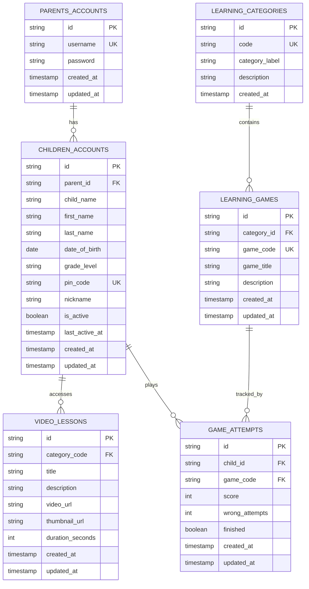

# E-Learning System - Entity Relationship Diagram

## System Overview

### Core Entities

**1. Parents_Accounts**
- Manages parent/guardian login credentials
- Each parent can have multiple children
- Stores username and password for authentication

**2. Children_Accounts**
- Student/child profile information
- Linked to a parent
- Contains PIN for student device access
- Tracks grade level and basic demographics
- Uses `is_active` to indicate whether the child is enrolled
- Uses `last_active_at` to record the latest student-app activity for online/offline presence

**3. Learning_Categories**
- Subject categories: Colors, Shapes, Letters, Numbers, Phonics, Logic
- Organizes learning content into themes

**4. Learning_Games**
- Individual games within each category
- Each game belongs to one category
- Represents specific learning activities

**5. Video_Lessons**
- Instructional video content
- Associated with learning categories
- Contains metadata (URL, duration, thumbnail)

**6. Game_Attempts** (Tracked through views)
- Records child's performance in games
- Captures score, attempts, and completion status
- Enables progress tracking

### Key Relationships

- **Parent → Children**: One-to-Many (1 parent manages multiple children)
- **Category → Games**: One-to-Many (1 category contains multiple games)
- **Child → Game Attempts**: One-to-Many (1 child plays multiple games)
- **Child → Video Lessons**: Many-to-Many (children access various lessons)

### Data Views (for Analytics/Progress)

- `v_child_overall_progress`: Aggregated progress percentage per child
- `v_child_category_progress`: Progress breakdown by category
- `v_child_recent_activity`: Recent game attempts and performance

### Security Features

- Parent accounts use username/password authentication
- Student access via PIN code (4-digit)
- Active status flag for child accounts

## Supabase Migration: Student Presence

The file [`supabase/student_presence.sql`](supabase/student_presence.sql) is a one-time database migration for the student-presence feature. It is not imported or executed by the React/Capacitor app at runtime. A developer or database administrator runs it once in the Supabase SQL Editor for the project.

The migration performs two database changes:

1. Adds `last_active_at` (`timestamptz`) to `public.children_accounts` if the column does not exist yet.
2. Adds an index on `last_active_at` so queries that sort or filter by recent activity remain efficient.

The presence flow is:

1. While a child is using the student MobileApp, `MobileOrientationController.tsx` updates that child's `last_active_at` timestamp approximately every 60 seconds.
2. The teacher MobileApp reads `last_active_at` from Supabase.
3. A currently enrolled child whose timestamp is less than two minutes old is displayed as **Online**; otherwise the child is displayed as **Offline**.

`is_active` and `last_active_at` have different meanings:

- `is_active`: whether the student is enrolled/allowed to use the account.
- `last_active_at`: when the student last used the MobileApp.

Because the SQL uses `if not exists`, it is safe to run again if the column and index have already been created. The SQL file should remain in source control so new environments can apply the same database setup.
