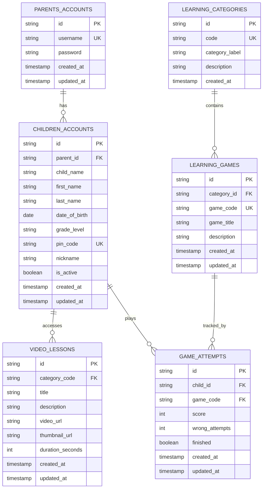

# E-Learning System - Entity Relationship Diagram

## System Overview

### Core Entities

**1. Parents_Accounts**
- Manages parent/guardian login credentials
- Each parent can have multiple children
- Stores username and password for authentication

**2. Children_Accounts**
- Student/child profile information
- Linked to a parent
- Contains PIN for student device access
- Tracks grade level and basic demographics

**3. Learning_Categories**
- Subject categories: Colors, Shapes, Letters, Numbers, Phonics, Logic
- Organizes learning content into themes

**4. Learning_Games**
- Individual games within each category
- Each game belongs to one category
- Represents specific learning activities

**5. Video_Lessons**
- Instructional video content
- Associated with learning categories
- Contains metadata (URL, duration, thumbnail)

**6. Game_Attempts** (Tracked through views)
- Records child's performance in games
- Captures score, attempts, and completion status
- Enables progress tracking

### Key Relationships

- **Parent → Children**: One-to-Many (1 parent manages multiple children)
- **Category → Games**: One-to-Many (1 category contains multiple games)
- **Child → Game Attempts**: One-to-Many (1 child plays multiple games)
- **Child → Video Lessons**: Many-to-Many (children access various lessons)

### Data Views (for Analytics/Progress)

- `v_child_overall_progress`: Aggregated progress percentage per child
- `v_child_category_progress`: Progress breakdown by category
- `v_child_recent_activity`: Recent game attempts and performance

### Security Features

- Parent accounts use username/password authentication
- Student access via PIN code (4-digit)
- Active status flag for child accounts
